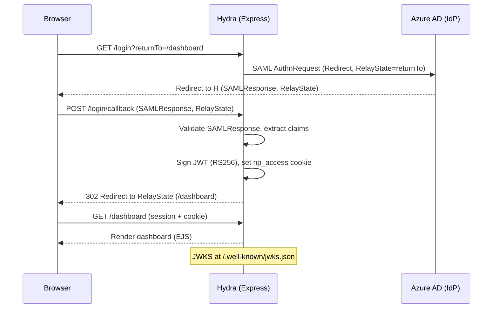
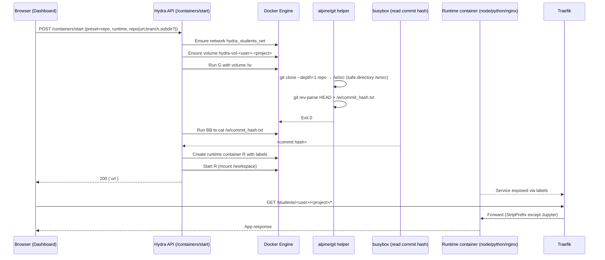
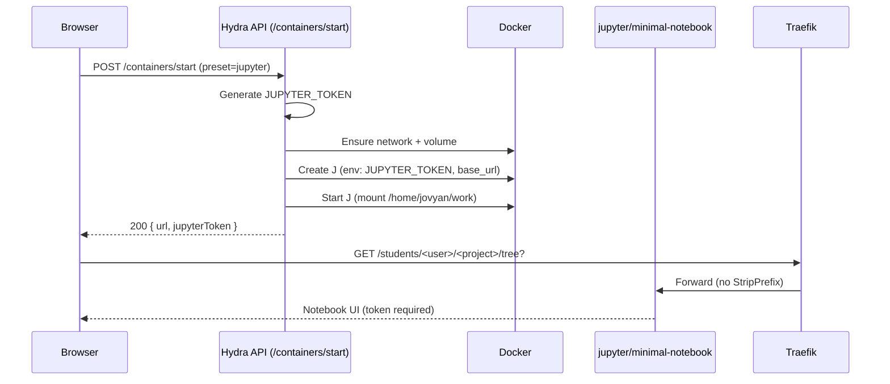
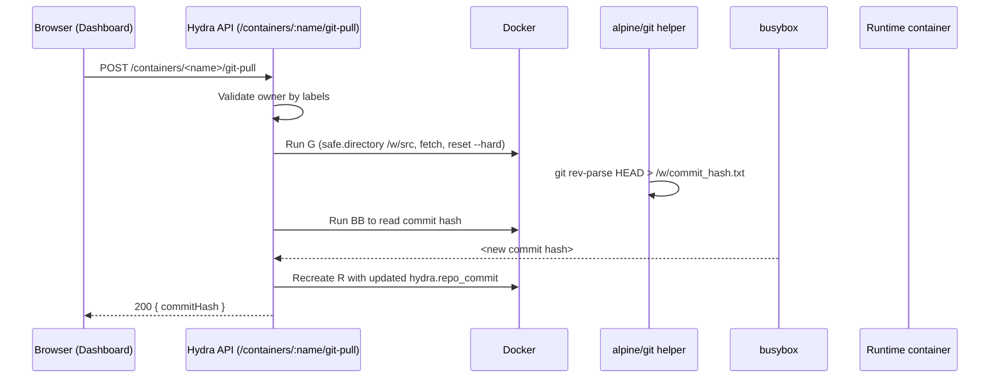
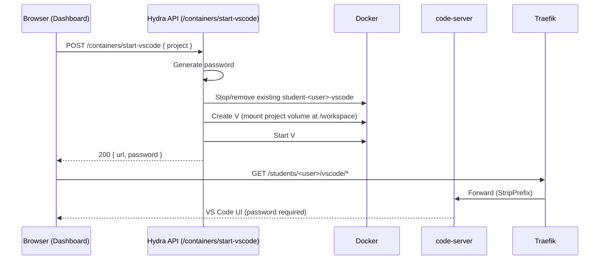
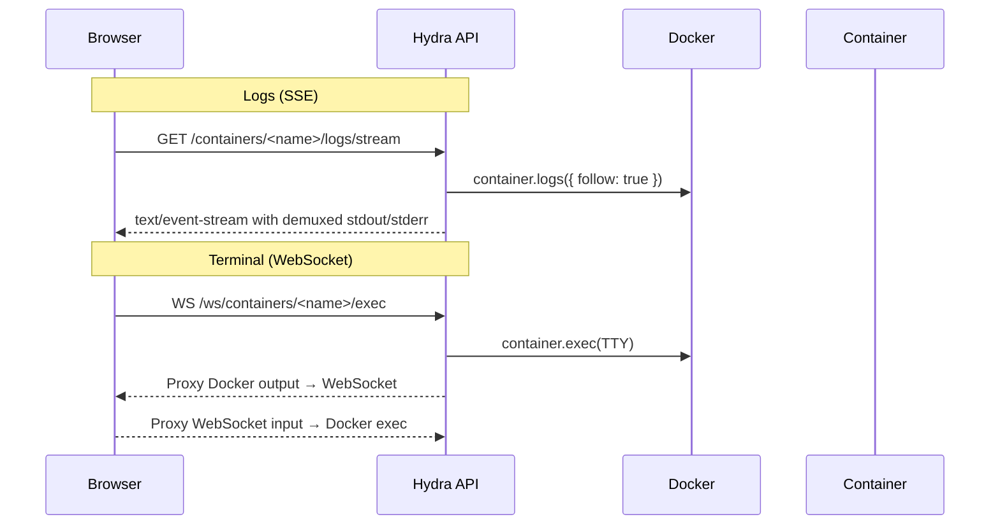

# Hydra Student Containers

This document describes the current system that powers student-run containers on Hydra: what changed recently, how it works end-to-end, and how to troubleshoot common issues.

- Updated: 2025-10-04
- Scope: Jupyter and Static presets, GitHub repo-backed runtimes (Node/Python/nginx), VS Code in the browser, Traefik path routing, and container lifecycle (restart/delete/logs/terminal).

## High-level overview

- SAML-authenticated users can start per-project containers.
- Each project has a persistent Docker named volume: `hydra-vol-<user>-<project>`.
- All containers attach to a shared bridge network: `hydra_students_net`.
- Traefik routes requests at `/students/<user>/<project>` to the corresponding container. Jupyter uses base_url; others use StripPrefix.
- GitHub repositories can be cloned into a project volume via ephemeral helper containers.
- VS Code (code-server) can be started to mount any project volume for in-browser development.

## Components

- Hydra (Express app)
  - SAML login, JWT cookie, JWKS endpoint
  - API routes for container lifecycle and integrations
  - WebSocket terminal bridge
- Docker Engine
  - Creates per-project named volumes, containers, and network membership
- Traefik
  - Path-based routing to student containers
- Helper containers
  - `alpine/git` to clone/fetch
  - `busybox` to read commit hashes
  - `jupyter/minimal-notebook`, `node:20-alpine`, `python:3.11-slim`, `nginx:alpine`, `codercom/code-server`

## End-to-end flows

### 1) SAML login → JWT cookie → Dashboard

### 2) Start a container “From GitHub” (clone + runtime)

### 3) Jupyter preset launch

### 4) “Pull Latest” on a repo container

### 5) Start VS Code for a project

### 6) Logs (SSE) and Terminal (WebSocket)

## Labels and routing

Common hydra labels:
- `hydra.managed_by=hydra-saml-auth`
- `hydra.owner=<username>`
- `hydra.ownerEmail=<user@school>`
- `hydra.project=<project>`
- `hydra.basePath=/students/<user>/<project>`
- `hydra.public_url=https://.../students/<user>/<project>/`
- `hydra.created_at=<ISO timestamp>`

Preset-specific:
- Jupyter: `hydra.preset=jupyter`, `hydra.jupyter_token=<token>`
- Repo: `hydra.preset=repo`, `hydra.runtime`, `hydra.repo_url`, `hydra.repo_branch?`, `hydra.repo_subdir?`, `hydra.repo_commit`
- VS Code: `hydra.type=vscode`, `hydra.mounted_project`, `hydra.vscode_password`

Traefik labels per container:
- `traefik.http.routers.<name>.entrypoints=web`
- `traefik.http.routers.<name>.rule=PathPrefix("/students/<user>/<segment>")`
- `traefik.http.services.<name>.loadbalancer.server.port=<internalPort>`
- StripPrefix middleware for everything except Jupyter.

## Git considerations

- Git helper containers may run as a different UID/GID than the volume owner. To avoid Git 2.35+ ownership safety errors, we configure:
  - `git config --global --add safe.directory /w/src`
- Private repositories are not handled by default (prompts disabled). Add credential helper/token support if needed.

## Resources and limits

- Defaults
  - Jupyter: 512MB RAM, 1 CPU
  - Static: 256MB RAM, 0.5 CPU
  - Repo runtimes: 512MB RAM, 1 CPU
- Overrides: `resources: { memMB, cpus }` in start request.

## Security model

- All operations require an authenticated session (SAML).
- Every action verifies ownership by checking container labels (`hydra.owner` and `hydra.managed_by`).
- VS Code passwords are random per start and stored in labels; dashboard displays them securely to the owner.

## Troubleshooting

- Git clone/pull failed with "detected dubious ownership"
  - Fixed: We mark `/w/src` as a safe directory inside helper containers.
- App 404 under path prefix
  - Ensure StripPrefix label exists for runtime/static apps.
  - Jupyter must be launched with `NotebookApp.base_url` and must NOT StripPrefix.
- VS Code starts but can’t write files
  - The system attempts `chown -R 1000:1000 /workspace` after start. Ownership issues can still occur depending on host setup; you may need to adjust.
- Container not reachable
  - Check that it’s on `hydra_students_net` and Traefik is running; labels must reference the right router/service names.

## File map

- `routes/containers.js` — container lifecycle (presets, repo clone/pull, VS Code, list, logs, restart, delete)
- `views/dashboard.ejs` — dashboard UI and client-side logic (tabs, forms, SSE, WS terminal)
- `index.js` — SAML boot, JWT/JWKS, route mounts, WS terminal bridge
- `docker-compose.yaml` — host networking for hydra-saml-auth, Traefik service and network

